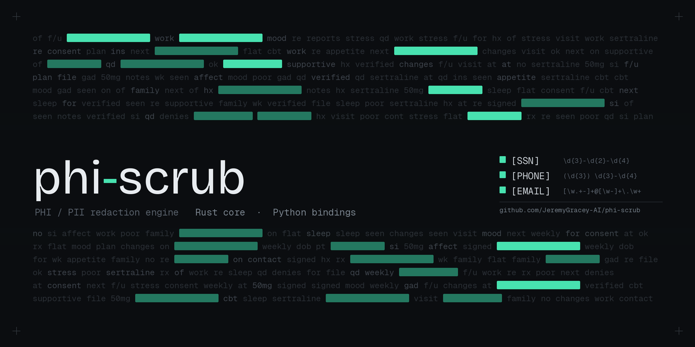

# phi-scrub

[](https://crates.io/crates/phi-scrub)
[](https://pypi.org/project/phi-scrub/)
[](https://github.com/JeremyGracey-AI/phi-scrub/actions/workflows/ci.yml)
[](LICENSE)

HIPAA-oriented PHI/PII redaction for telehealth and behavioral-health notes. Rust engine, Python package, single-binary CLI.

## Install

**Rust** — [crates.io/crates/phi-scrub](https://crates.io/crates/phi-scrub)
```bash
cargo add phi-scrub
```

**Python** — [pypi.org/project/phi-scrub](https://pypi.org/project/phi-scrub/)
```bash
uv add phi-scrub
```

**CLI**
```bash
cargo install phi-scrub
echo "SSN 123-45-6789, call 808-555-0100" | phi-scrub
# SSN [SSN], call [PHONE]
```

## Use

```rust
use phi_scrub::Scrubber;
let out = Scrubber::new().redact("mail me@example.com");
// "mail [EMAIL]"
```

```python
import phi_scrub
s = phi_scrub.Scrubber()
s.redact("SSN 123-45-6789")   # 'SSN [SSN]'
s.detect("call (808) 555-0100")  # [Finding(start=5, end=19, category='phone')]
```

## Detectors

| Token | Pattern |
|---|---|
| `[SSN]` | `\d{3}-\d{2}-\d{4}` |
| `[PHONE]` | `(\d{3}) \d{3}-\d{4}` and `\d{3}-\d{3}-\d{4}` variants |
| `[EMAIL]` | RFC-ish local@domain |

More detectors (names, dates, MRNs, addresses) on the roadmap.

## Develop

```bash
cargo fmt --check && cargo clippy --all-targets -- -D warnings && cargo test
uv sync && uv run maturin develop --release && uv run pytest python/tests -q
```

## License

Apache-2.0 — see [LICENSE](LICENSE).
